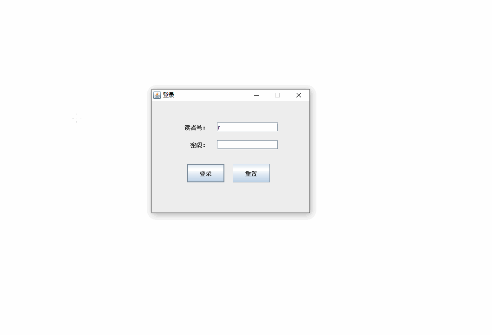

# 图书借阅管理系统（WEB版）
>#### 一个基于Java Swing的图书借阅管理系统。

# 项目简介
此项目为图书管理系统（WEB版）的前端GUI版。
对应的后端项目地址
[github-eclipse-repo](https://github.com/lyz05/github-eclipse-repo/tree/master/book)

# 运行环境
在有良好的互联网连接的情况下
在装有jre的GUI环境下直接打开dist下的[Ch09.jar](dist/Ch09.jar)

# JAVA软件截图

